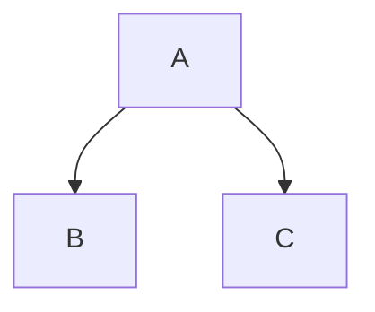

# Slidev Best Practices

## Markdown Syntax

Slidev uses extended Markdown.

### Slide Separator
Use `---` (three dashes) surrounded by newlines to separate slides.

```markdown
# Slide 1

---

# Slide 2
```

### Frontmatter
Each slide can have a frontmatter block for configuration.

```markdown
---
layout: cover
background: ./images/bg.png
class: text-white
transition: slide-left
---
```

### Text Styling (UnoCSS)
Slidev integrates UnoCSS. You can use utility classes directly in Markdown or HTML.

```html
<div class="text-red-500 font-bold">
  Important Text
</div>
```

Or using class abbreviation in elements:

```markdown
# My Title {.text-4xl .text-center}
```

## Components

### Animations
- `<v-click>`: Hide content until next click.
- `<v-clicks>`: Sequentially reveal list items.

```html
<v-clicks>
- Item 1
- Item 2
- Item 3
</v-clicks>
```

### Code Blocks
Slidev uses Shiki for highlighting.

```ts {monaco}
// {monaco} enables the Monaco editor
console.log('Hello World')
```

### Diagrams (Mermaid)
Wrap mermaid code in `mermaid` code blocks.



## Layouts usage
Define layout in frontmatter.

```markdown
---
layout: two-cols
---

::left::
# Left Content

::right::
# Right Content
```

## Icons
Use Iconify icons directly.
Convention: `<collection-icon-name />` or class `i-collection-icon-name`.
Example: `<carbon-logo-github />`
